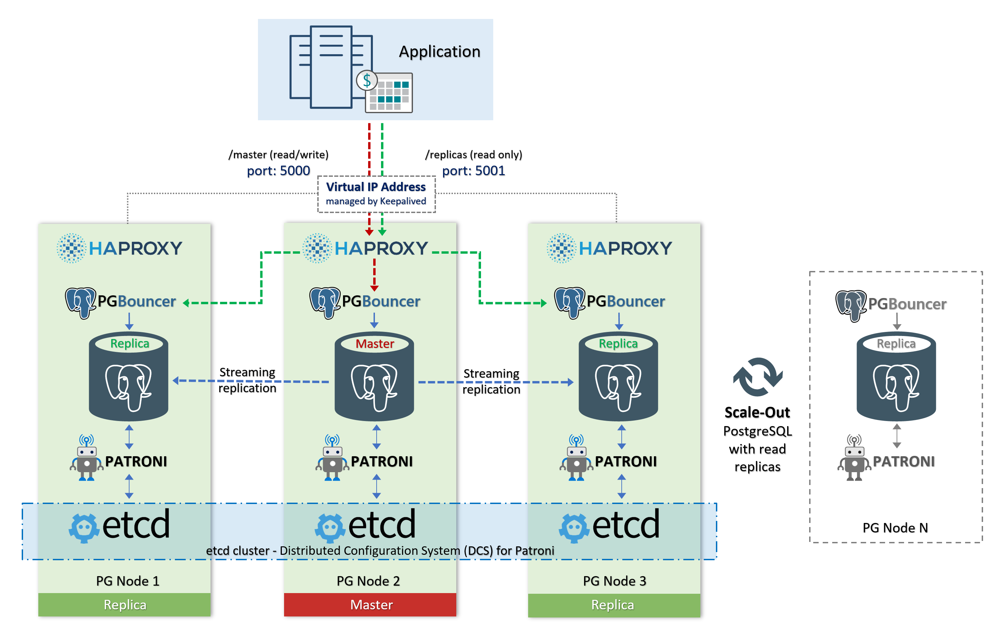
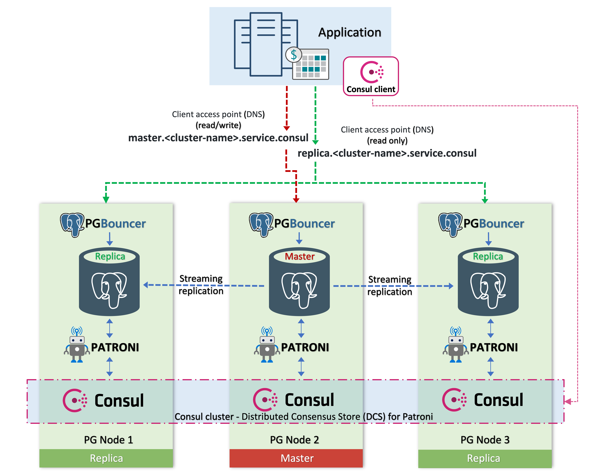

# PostgreSQL High-Availability Cluster :elephant: :sparkling_heart:

[](https://galaxy.ansible.com/vitabaks/postgresql_cluster)
[](https://github.com/vitabaks/postgresql_cluster/actions?query=workflow%3AAnsible-lint)
[](https://github.com/vitabaks/postgresql_cluster/actions?query=workflow%3AYamllint)
[](https://github.com/vitabaks/postgresql_cluster/actions?query=workflow%3AFlake8)
[](https://github.com/vitabaks/postgresql_cluster/actions?query=workflow%3AMolecule)
[](https://github.com/vitabaks/postgresql_cluster/blob/master/LICENSE) 


### Deploy a Production Ready PostgreSQL High-Availability Cluster (based on "Patroni" and DCS "etcd" or "consul"). Automating with Ansible.

This Ansible playbook is designed for deploying a PostgreSQL high availability cluster on dedicated physical servers for a production environment. The cluster can also be deployed on virtual machines and in the Cloud.

In addition to deploying new clusters, this playbook also support the deployment of cluster over already existing and running PostgreSQL. You can convert your basic PostgreSQL installation to a high availability cluster. Just specify the variable `postgresql_exists='true'` in the inventory file.
**Attention!** Your PostgreSQL will be stopped before running in cluster mode (please plan for a short downtime of databases).

> :heavy_exclamation_mark: Please test it in your test environment before using in a production.

---

:trophy: _Please consider [sponsoring](https://github.com/vitabaks/postgresql_cluster#sponsor-this-project) this project. It is necessary that this open source project become even better, so that more functionality and automation are added. Also, some membership levels include live chat with me and personalized support._


## Index
- [Cluster types](#cluster-types)
    - [[Type A] PostgreSQL High-Availability with HAProxy Load Balancing](#type-a-postgresql-high-availability-with-haproxy-load-balancing)
    - [[Type B] PostgreSQL High-Availability only](#type-b-postgresql-high-availability-only)
    - [[Type C] PostgreSQL High-Availability with Consul Service Discovery (DNS)](#type-c-postgresql-high-availability-with-consul-service-discovery-dns)
- [Compatibility](#compatibility)
    - [Supported Linux Distributions:](#supported-linux-distributions)
    - [PostgreSQL versions:](#postgresql-versions)
    - [Ansible version](#ansible-version)
- [Requirements](#requirements)
- [Port requirements](#port-requirements)
- [Recommendations](#recommenations)
- [Deployment: quick start](#deployment-quick-start)
- [Variables](#variables)
- [Cluster Scaling](#cluster-scaling)
    - [Steps to add a new postgres node](#steps-to-add-a-new-postgres-node)
    - [Steps to add a new balancer node](#steps-to-add-a-new-balancer-node)
- [Restore and Cloning](#restore-and-cloning)
    - [Create cluster with pgBackRest:](#create-cluster-with-pgbackrest)
    - [Create cluster with WAL-G:](#create-cluster-with-wal-g)
    - [Point-In-Time-Recovery:](#point-in-time-recovery)
- [Maintenance](#maintenance)
    - [Update the PostgreSQL HA Cluster](#update-the-postgresql-ha-cluster)
    - [PostgreSQL major upgrade](#postgresql-major-upgrade)
    - [Using Git for cluster configuration management](#using-git-for-cluster-configuration-management-iacgitops)
- [Disaster Recovery](#disaster-recovery)
    - [etcd](#etcd)
    - [PostgreSQL (databases)](#postgresql-databases)
- [How to start from scratch](#how-to-start-from-scratch)
- [License](#license)
- [Author](#author)
- [Sponsor this project](#sponsor-this-project)
- [Feedback, bug-reports, requests, ...](#feedback-bug-reports-requests-)

## Cluster types

You have three schemes available for deployment:

### [Type A] PostgreSQL High-Availability with HAProxy Load Balancing


> To use this scheme, specify `with_haproxy_load_balancing: true` in variable file vars/main.yml

This scheme provides the ability to distribute the load on reading. This also allows us to scale out the cluster (with read-only replicas).

- port 5000 (read / write) master
- port 5001 (read only) all replicas

###### if variable "synchronous_mode" is 'true' (vars/main.yml):
- port 5002 (read only) synchronous replica only
- port 5003 (read only) asynchronous replicas only

> :heavy_exclamation_mark: Your application must have support sending read requests to a custom port (ex 5001), and write requests (ex 5000).

##### Components of high availability:
[**Patroni**](https://github.com/zalando/patroni) is a template for you to create your own customized, high-availability solution using Python and - for maximum accessibility - a distributed configuration store like ZooKeeper, etcd, Consul or Kubernetes. Used for automate the management of PostgreSQL instances and auto failover.

[**etcd**](https://github.com/etcd-io/etcd) is a distributed reliable key-value store for the most critical data of a distributed system. etcd is written in Go and uses the [Raft](https://raft.github.io/) consensus algorithm to manage a highly-available replicated log. It is used by Patroni to store information about the status of the cluster and PostgreSQL configuration parameters.

[What is Distributed Consensus?](http://thesecretlivesofdata.com/raft/)

##### Components of load balancing:
[**HAProxy**](http://www.haproxy.org/) is a free, very fast and reliable solution offering high availability, load balancing, and proxying for TCP and HTTP-based applications. 

[**confd**](https://github.com/kelseyhightower/confd) manage local application configuration files using templates and data from etcd or consul. Used to automate HAProxy configuration file management.

[**Keepalived**](https://github.com/acassen/keepalived) provides a virtual high-available IP address (VIP) and single entry point for databases access.
Implementing VRRP (Virtual Router Redundancy Protocol) for Linux.
In our configuration keepalived checks the status of the HAProxy service and in case of a failure delegates the VIP to another server in the cluster.

[**PgBouncer**](https://pgbouncer.github.io/features.html) is a connection pooler for PostgreSQL.


### [Type B] PostgreSQL High-Availability only


This is simple scheme without load balancing `Used by default`

To provide a single entry point (VIP) for database access is used "vip-manager". If the variable `cluster_vip` is specified (optional).

[**vip-manager**](https://github.com/cybertec-postgresql/vip-manager) is a service that gets started on all cluster nodes and connects to the DCS. If the local node owns the leader-key, vip-manager starts the configured VIP. In case of a failover, vip-manager removes the VIP on the old leader and the corresponding service on the new leader starts it there. \
Written in Go. Cybertec Schönig & Schönig GmbH https://www.cybertec-postgresql.com


### [Type C] PostgreSQL High-Availability with Consul Service Discovery (DNS)


> To use this scheme, specify `dcs_type: consul` in variable file vars/main.yml

This scheme is suitable for master-only access and for load balancing (using DNS) for reading across replicas. Consul [Service Discovery](https://developer.hashicorp.com/consul/docs/concepts/service-discovery) with [DNS resolving ](https://developer.hashicorp.com/consul/docs/discovery/dns) is used as a client access point to the database.

Client access point (example):

- `master.postgres-cluster.service.consul`
- `replica.postgres-cluster.service.consul`

Besides, it can be useful for a distributed cluster across different data centers. We can specify in advance which data center the database server is located in and then use this for applications running in the same data center. 

Example: `replica.postgres-cluster.service.dc1.consul`, `replica.postgres-cluster.service.dc2.consul`

It requires the installation of a consul in client mode on each application server for service DNS resolution (or use [forward DNS](https://developer.hashicorp.com/consul/tutorials/networking/dns-forwarding?utm_source=docs) to the remote consul server instead of installing a local consul client).

---
## Compatibility
RedHat and Debian based distros (x86_64)

###### Supported Linux Distributions:
- **Debian**: 10, 11, 12
- **Ubuntu**: 18.04, 20.04, 22.04
- **CentOS**: 7, 8
- **CentOS Stream**: 8, 9
- **Oracle Linux**: 7, 8, 9
- **Rocky Linux**: 8, 9
- **AlmaLinux**: 8, 9

###### PostgreSQL versions: 
all supported PostgreSQL versions

:white_check_mark: tested, works fine: PostgreSQL 10, 11, 12, 13, 14, 15, 16

_Table of results of daily automated testing of cluster deployment:_
| Distribution | Test result |
|--------------|:----------:|
| Debian 10    | [](https://github.com/vitabaks/postgresql_cluster/actions/workflows/schedule_pg_debian10.yml) |
| Debian 11    | [](https://github.com/vitabaks/postgresql_cluster/actions/workflows/schedule_pg_debian11.yml) |
| Debian 12    | [](https://github.com/vitabaks/postgresql_cluster/actions/workflows/schedule_pg_debian12.yml) |
| Ubuntu 18.04 | [](https://github.com/vitabaks/postgresql_cluster/actions/workflows/schedule_pg_ubuntu1804.yml) |
| Ubuntu 20.04 | [](https://github.com/vitabaks/postgresql_cluster/actions/workflows/schedule_pg_ubuntu2004.yml) |
| Ubuntu 22.04 | [](https://github.com/vitabaks/postgresql_cluster/actions/workflows/schedule_pg_ubuntu2204.yml) |
| CentOS Stream 8 | [](https://github.com/vitabaks/postgresql_cluster/actions/workflows/schedule_pg_centosstream8.yml) |
| CentOS Stream 9 | [](https://github.com/vitabaks/postgresql_cluster/actions/workflows/schedule_pg_centosstream9.yml) |
| Oracle Linux 8 | [](https://github.com/vitabaks/postgresql_cluster/actions/workflows/schedule_pg_oracle_linux8.yml) |
| Oracle Linux 9 | [](https://github.com/vitabaks/postgresql_cluster/actions/workflows/schedule_pg_oracle_linux9.yml) |
| Rocky Linux 8 | [](https://github.com/vitabaks/postgresql_cluster/actions/workflows/schedule_pg_rockylinux8.yml) |
| Rocky Linux 9 | [](https://github.com/vitabaks/postgresql_cluster/actions/workflows/schedule_pg_rockylinux9.yml) |
| AlmaLinux 8 | [](https://github.com/vitabaks/postgresql_cluster/actions/workflows/schedule_pg_almalinux8.yml) |
| AlmaLinux 9 | [](https://github.com/vitabaks/postgresql_cluster/actions/workflows/schedule_pg_almalinux9.yml) |


###### Ansible version 
Minimum supported Ansible version: 2.11.0

## Requirements
This playbook requires root privileges or sudo.

Ansible ([What is Ansible](https://www.ansible.com/resources/videos/quick-start-video)?)

if dcs_type: "consul", please install consul role requirements on the control node:

`ansible-galaxy install -r roles/consul/requirements.yml`

## Port requirements
List of required TCP ports that must be open for the database cluster:

- `5432` (postgresql)
- `6432` (pgbouncer)
- `8008` (patroni rest api)
- `2379`, `2380` (etcd)

for the scheme "[Type A] PostgreSQL High-Availability with Load Balancing":

- `5000` (haproxy - (read/write) master)
- `5001` (haproxy - (read only) all replicas)
- `5002` (haproxy - (read only) synchronous replica only)
- `5003` (haproxy - (read only) asynchronous replicas only)
- `7000` (optional, haproxy stats)

for the scheme "[Type C] PostgreSQL High-Availability with Consul Service Discovery (DNS)":

- `8300` (Consul Server RPC)
- `8301` (Consul Serf LAN)
- `8302` (Consul Serf WAN)
- `8500` (Consul HTTP API)
- `8600` (Consul DNS server)


## Recommenations
- **linux (Operation System)**: 

Update your operating system on your target servers before deploying;

Make sure you have time synchronization is configured (NTP).
Specify `ntp_enabled:'true'` and `ntp_servers` if you want to install and configure the ntp service.

- **DCS (Distributed Consensus Store)**: 

Fast drives and a reliable network are the most important factors for the performance and stability of an etcd (or consul) cluster.

Avoid storing etcd (or consul) data on the same drive along with other processes (such as the database) that are intensively using the resources of the disk subsystem! 
Store the etcd and postgresql data on **different** disks (see `etcd_data_dir`, `consul_data_path` variables), use ssd drives if possible.
See [hardware recommendations](https://etcd.io/docs/v3.3/op-guide/hardware/) and [tuning](https://etcd.io/docs/v3.3/tuning/) guides.

It is recommended to deploy the DCS cluster on dedicated servers, separate from the database servers.

- **Placement of cluster members in different data centers**:

If you’d prefer a cross-data center setup, where the replicating databases are located in different data centers, etcd member placement becomes critical.

There are quite a lot of things to consider if you want to create a really robust etcd cluster, but there is one rule: *do not placing all etcd members in your primary data center*. See some [examples](https://www.cybertec-postgresql.com/en/introduction-and-how-to-etcd-clusters-for-patroni/).


- **How to prevent data loss in case of autofailover (synchronous_modes and pg_rewind)**:

Due to performance reasons, a synchronous replication is disabled by default.

To minimize the risk of losing data on autofailover, you can configure settings in the following way:
- synchronous_mode: 'true'
- synchronous_mode_strict: 'true'
- synchronous_commit: 'on' (or 'remote_apply')
- use_pg_rewind: 'false' (enabled by default)

---

## Deployment: quick start
0. [Install Ansible](https://docs.ansible.com/ansible/latest/installation_guide/intro_installation.html) on one control node (which could easily be a laptop)

```
sudo apt update && sudo apt install -y python3-pip sshpass git
pip3 install ansible
```

1. Download or clone this repository

```
git clone https://github.com/vitabaks/postgresql_cluster.git
```

2. Go to the playbook directory

```
cd postgresql_cluster/
```

3. Edit the inventory file

###### Specify (non-public) IP addresses and connection settings (`ansible_user`, `ansible_ssh_pass` or `ansible_ssh_private_key_file` for your environment

```
nano inventory
```

4. Edit the variable file vars/[main.yml](./vars/main.yml)

```
nano vars/main.yml
```

###### Minimum set of variables: 
- `proxy_env` # if required (*for download packages*)
- `cluster_vip` # for client access to databases in the cluster (optional)
- `patroni_cluster_name`
- `postgresql_version`
- `postgresql_data_dir`
- `with_haproxy_load_balancing` `'true'` (Type A) or `'false'`/default (Type B)
- `dcs_type` # "etcd" (default) or "consul" (Type C)

if dcs_type: "consul", please install consul role requirements on the control node:

```
ansible-galaxy install -r roles/consul/requirements.yml
```

5. Try to connect to hosts

```
ansible all -m ping
```

6. Run playbook:

```
ansible-playbook deploy_pgcluster.yml
```

### Deploy Cluster with TimescaleDB

To deploy a PostgreSQL High-Availability Cluster with the TimescaleDB extension, you just need to add the `enable_timescale` variable.

Example:
```
ansible-playbook deploy_pgcluster.yml -e "enable_timescale=true"
```

[](https://asciinema.org/a/251019?speed=5)

---

## Variables
See the vars/[main.yml](./vars/main.yml), [system.yml](./vars/system.yml) and ([Debian.yml](./vars/Debian.yml) or [RedHat.yml](./vars/RedHat.yml)) files for more details.


## Cluster Scaling

After you successfully deployed your PostgreSQL HA cluster, you may need to scale it further. \
Use the `add_pgnode.yml` playbook for this.

<details><summary>Add new postgresql node to existing cluster</summary><p>

> This playbook does not scaling the etcd cluster or consul cluster.

During the run this playbook, the new nodes will be prepared in the same way as when first deployment the cluster. But unlike the initial deployment, all the necessary **configuration files will be copied from the master server**.

###### Steps to add a new Postgres node:

1. Add a new node to the inventory file with the variable `new_node=true`
2. Run `add_pgnode.yml` playbook 

In this example, we add a node with the IP address 10.128.64.144

```
[master]
10.128.64.140 hostname=pgnode01 postgresql_exists='true'

[replica]
10.128.64.142 hostname=pgnode02 postgresql_exists='true'
10.128.64.143 hostname=pgnode03 postgresql_exists='true'
10.128.64.144 hostname=pgnode04 postgresql_exists=false new_node=true
```

Run playbook:

```
ansible-playbook add_pgnode.yml
```

</p></details>

<details><summary>Add new haproxy balancer node</summary><p>

During the run this playbook, the new balancer node will be prepared in the same way as when first deployment the cluster. But unlike the initial deployment, all necessary **configuration files will be copied from the first server specified in the inventory file in the "balancers" group**.

###### Steps to add a new balancer node:

Note: Used if the `with_haproxy_load_balancing` variable is set to `true`

1. Add a new node to the inventory file with the variable `new_node=true`

2. Run `add_balancer.yml` playbook 


 In this example, we add a balancer node with the IP address 10.128.64.144

```
[balancers]
10.128.64.140
10.128.64.142
10.128.64.143
10.128.64.144 new_node=true
```

Run playbook:

```
ansible-playbook add_balancer.yml
```

</p></details>


## Restore and Cloning
Create new clusters from your existing backups with [pgBackRest](https://github.com/pgbackrest/pgbackrest) or [WAL-G](https://github.com/wal-g/wal-g) \
Point-In-Time-Recovery

<details><summary>Click here to expand...</summary><p>

##### Create cluster with pgBackRest:
1. Edit the `main.yml` variable file
```
patroni_cluster_bootstrap_method: "pgbackrest"

patroni_create_replica_methods:
  - pgbackrest
  - basebackup

postgresql_restore_command: "pgbackrest --stanza={{ pgbackrest_stanza }} archive-get %f %p"

pgbackrest_install: true
pgbackrest_stanza: "stanza_name"  # specify your --stanza
pgbackrest_repo_type: "posix"  # or "s3"
pgbackrest_repo_host: "ip-address"  # dedicated repository host (if repo_type: "posix")
pgbackrest_repo_user: "postgres"  # if "repo_host" is set
pgbackrest_conf:  # see more options https://pgbackrest.org/configuration.html
  global:  # [global] section
    - {option: "xxxxxxx", value: "xxxxxxx"}
    ...
  stanza:  # [stanza_name] section
    - {option: "xxxxxxx", value: "xxxxxxx"}
    ...
    
pgbackrest_patroni_cluster_restore_command:
  '/usr/bin/pgbackrest --stanza={{ pgbackrest_stanza }} --type=time "--target=2020-06-01 11:00:00+03" --delta restore'
```
example for S3 https://github.com/vitabaks/postgresql_cluster/pull/40#issuecomment-647146432

2. Run playbook:

`ansible-playbook deploy_pgcluster.yml`


##### Create cluster with WAL-G:
1. Edit the `main.yml` variable file
```
patroni_cluster_bootstrap_method: "wal-g"

patroni_create_replica_methods:
  - wal_g
  - basebackup

postgresql_restore_command: "wal-g wal-fetch %f %p"

wal_g_install: true
wal_g_version: "2.0.1"
wal_g_json:  # config https://github.com/wal-g/wal-g#configuration
  - {option: "xxxxxxx", value: "xxxxxxx"}
  - {option: "xxxxxxx", value: "xxxxxxx"}
  ...
wal_g_patroni_cluster_bootstrap_command: "wal-g backup-fetch {{ postgresql_data_dir }} LATEST"
```
2. Run playbook:

`ansible-playbook deploy_pgcluster.yml`


##### Point-In-Time-Recovery:
You can run automatic restore of your existing patroni cluster \
for PITR, specify the required parameters in the main.yml variable file and run the playbook with the tag:
```
ansible-playbook deploy_pgcluster.yml --tags point_in_time_recovery
```
Recovery steps with pgBackRest:
```
1. Stop patroni service on the Replica servers (if running);
2. Stop patroni service on the Master server;
3. Remove patroni cluster "xxxxxxx" from DCS (if exist);
4. Run "/usr/bin/pgbackrest --stanza=xxxxxxx --delta restore" on Master;
5. Run "/usr/bin/pgbackrest --stanza=xxxxxxx --delta restore" on Replica (if patroni_create_replica_methods: "pgbackrest");
6. Waiting for restore from backup (timeout 24 hours);
7. Start PostgreSQL for Recovery (master and replicas);
8. Waiting for PostgreSQL Recovery to complete (WAL apply);
9. Stop PostgreSQL instance (if running);
10. Disable PostgreSQL archive_command (if enabled);
11. Start patroni service on the Master server;
12. Check PostgreSQL is started and accepting connections on Master;
13. Make sure the postgresql users (superuser and replication) are present, and password does not differ from the specified in vars/main.yml;
14. Update postgresql authentication parameter in patroni.yml (if superuser or replication users is changed);
15. Reload patroni service (if patroni.yml is updated);
16. Start patroni service on Replica servers;
17. Check that the patroni is healthy on the replica server (timeout 10 hours);
18. Check postgresql cluster health (finish).
```

**Why disable archive_command?**

This is necessary to avoid conflicts in the archived log storage when archiving WALs. When multiple clusters try to send WALs to the same storage. \
For example, when you make multiple clones of a cluster from one backup.

You can change this parameter using `patronictl edit-config` after restore. \
Or set `disable_archive_command: false` to not disable archive_command after restore.
</p></details>


## Maintenance

I recommend that you study the following materials for further maintenance of the cluster:

- [Tutorial: Management of High-Availability PostgreSQL clusters with Patroni](https://pgconf.ru/en/2018/108567)
- [Patroni documentation](https://patroni.readthedocs.io/en/latest/)
- [etcd operations guide](https://etcd.io/docs/v3.5/op-guide/)

### Update the PostgreSQL HA Cluster

Use the `update_pgcluster.yml` playbook for update the PostgreSQL HA Cluster to a new minor version (for example 15.1->15.2, and etc).

<details><summary>Update PostgreSQL</summary>

```
ansible-playbook update_pgcluster.yml -e target=postgres
```

</details>


<details><summary>Update Patroni</summary>

```
ansible-playbook update_pgcluster.yml -e target=patroni
```

</details>

<details><summary>Update all system</summary>

includes PostgreSQL and Patroni

```
ansible-playbook update_pgcluster.yml -e target=system
```

</details>

More details [here](roles/update/README.md)

### PostgreSQL major upgrade

Use the `pg_upgrade.yml` playbook to upgrade the PostgreSQL to a new major version (for example 14->15, and etc).

<details><summary>Upgrade PostgreSQL</summary>

```
ansible-playbook pg_upgrade.yml -e "pg_old_version=14 pg_new_version=15"
```

</details>

More details [here](roles/upgrade/README.md)


### Using Git for cluster configuration management (IaC/GitOps)

Infrastructure as Code (IaC) is the managing and provisioning of infrastructure through code instead of through manual processes. \
GitOps automates infrastructure updates using a Git workflow with continuous integration (CI) and continuous delivery (CI/CD). When new code is merged, the CI/CD pipeline enacts the change in the environment. Any configuration drift, such as manual changes or errors, is overwritten by GitOps automation so the environment converges on the desired state defined in Git. 

Once the cluster is deployed, you can use the `config_pgcluster.yml` playbook to integrate with Git to manage cluster configurations. \
For example, GitHub Action ([link](https://github.com/marketplace/actions/run-ansible-playbook)), GitLab CI/CD ([link](https://medium.com/geekculture/how-to-run-an-ansible-playbook-using-gitlab-ci-cd-2135f76d7f1e))

Details about IaC and GitOps:

- [What is GitOps](https://about.gitlab.com/topics/gitops/)?
- [What is Infrastructure as Code (IaC)](https://www.redhat.com/en/topics/automation/what-is-infrastructure-as-code-iac)?

## Disaster Recovery

A high availability cluster provides an automatic failover mechanism, and does not cover all disaster recovery scenarios.
You must take care of backing up your data yourself.
##### etcd
> Patroni nodes are dumping the state of the DCS options to disk upon for every change of the configuration into the file patroni.dynamic.json located in the Postgres data directory. The master (patroni leader) is allowed to restore these options from the on-disk dump if these are completely absent from the DCS or if they are invalid.

However, I recommend that you read the disaster recovery guide for the etcd cluster:
- [etcd disaster recovery](https://etcd.io/docs/v3.3.12/op-guide/recovery)

##### PostgreSQL (databases)
I can recommend the following backup and restore tools:
* [pgbackrest](https://github.com/pgbackrest/pgbackrest)
* [pg_probackup](https://github.com/postgrespro/pg_probackup)
* [wal-g](https://github.com/wal-g/wal-g)

Do not forget to validate your backups (for example [pgbackrest auto](https://github.com/vitabaks/pgbackrest_auto)).

## How to start from scratch
Should you need to start from very beginning, use the playbook `remove_cluster.yml`.

To prevent the script to be used by accident in a production environment, edit `remove_cluster.yml` and remove the *safety pin*. Change these variables accordingly:

- remove_postgres: true
- remove_etcd: true (or remove_consul)

Run the script and all the data are gone.

`ansible-playbook remove_cluster.yml`

A new installation can now be made from scratch.
 
:heavy_exclamation_mark: Be careful not to copy this script without the *safety pin* to the production environment.

---

## License
Licensed under the MIT License. See the [LICENSE](./LICENSE) file for details.

## Author
Vitaliy Kukharik (PostgreSQL DBA) \
vitabaks@gmail.com

## Sponsor this project

Support our work through [GitHub Sponsors](https://github.com/sponsors/vitabaks)

[](https://github.com/sponsors/vitabaks)

Support our work through [Patreon](https://www.patreon.com/vitabaks)

[](https://patreon.com/vitabaks)

Support our work through crypto wallet:

USDT (TRC20): `TSTSXZzqDCUDHDjZwCpuBkdukjuDZspwjj`

---

## Feedback, bug-reports, requests, ...
Are [welcome](https://github.com/vitabaks/postgresql_cluster/issues)!
